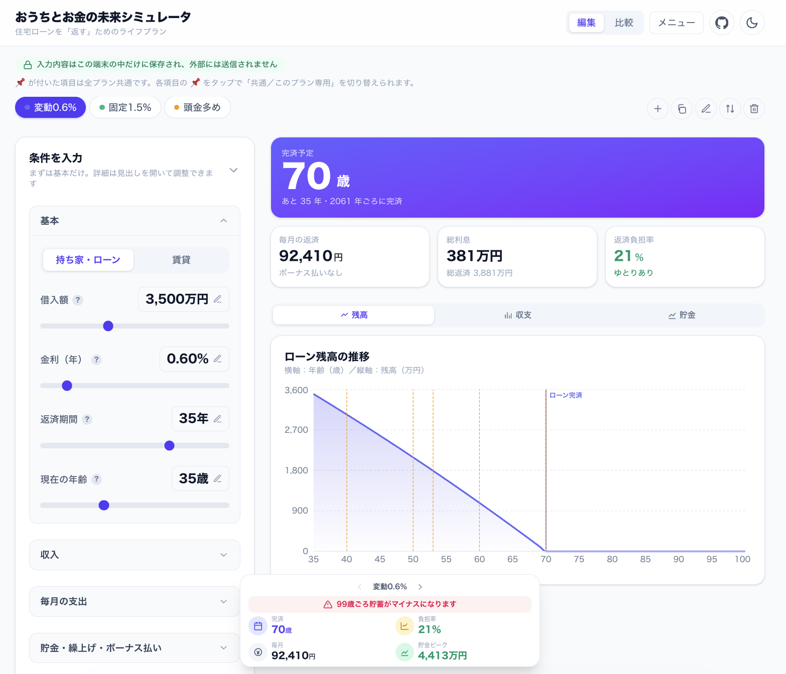
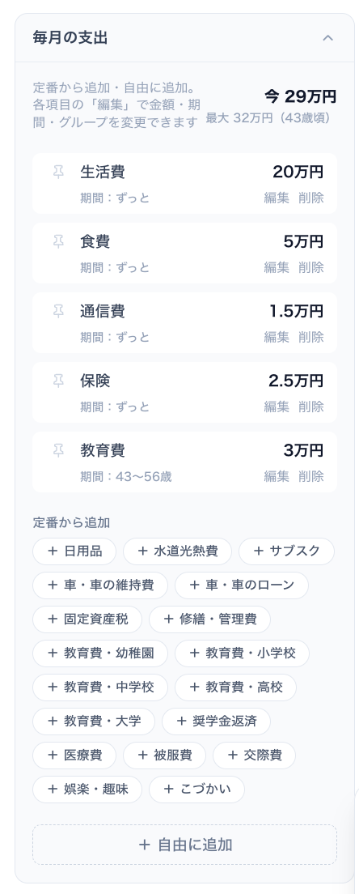
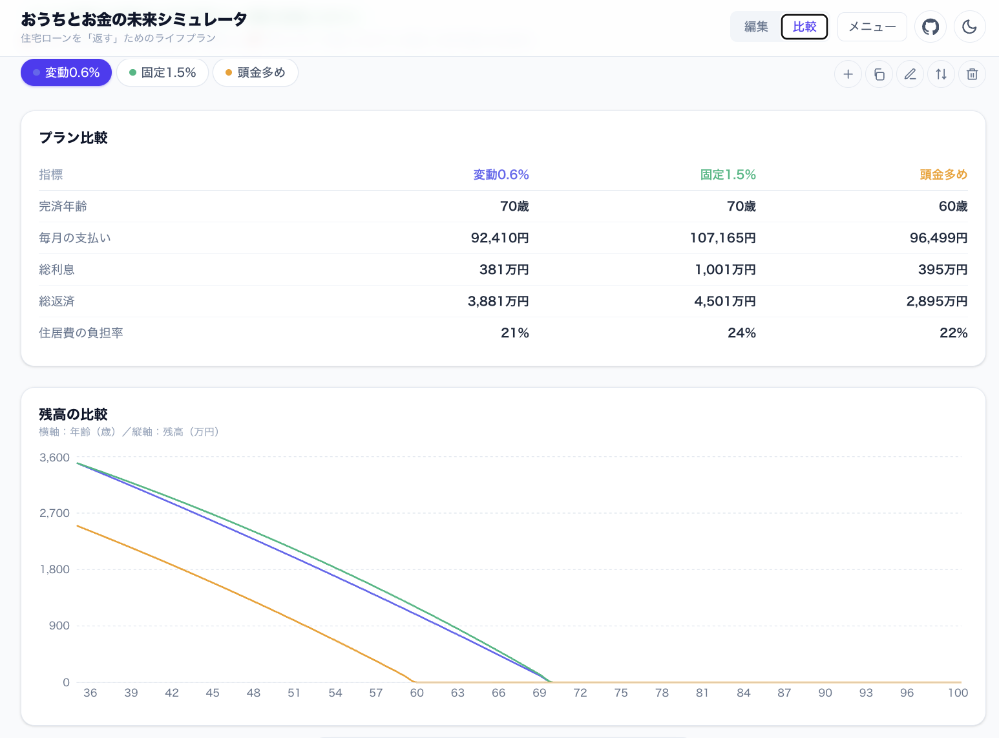
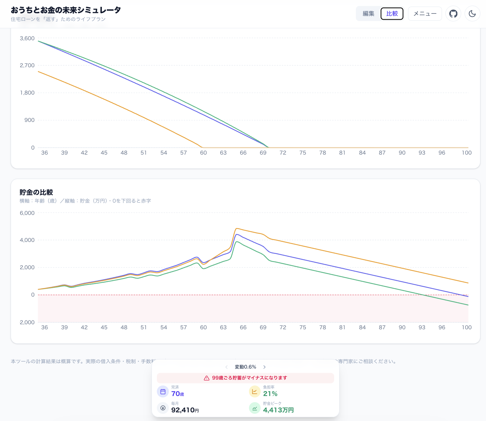
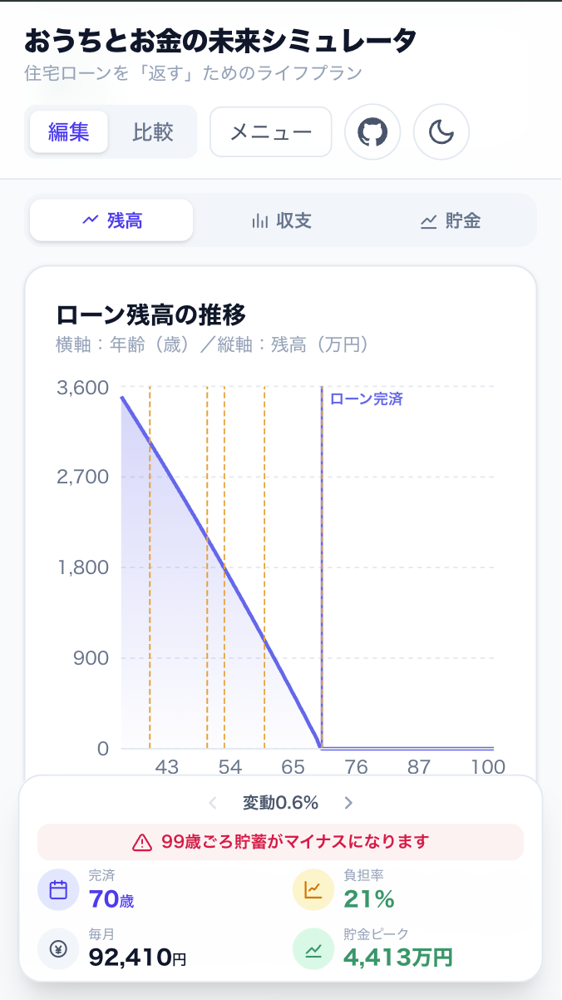
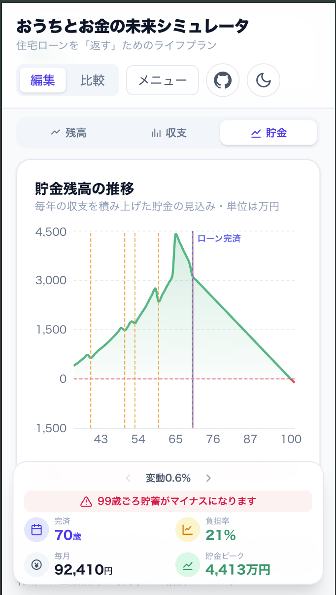

# おうちとお金の未来シミュレータ

住宅ローンを「組む」前の試算ではなく、**ローンを「返す」これからの暮らし**を見える化するライフプラン・シミュレータです。完済年齢・毎月の返済・家計のキャッシュフロー・貯金の推移を、グラフでまとめて確認できます。

**デモ → https://taogya.github.io/home-loan-simulator/**



> すべての計算はブラウザの中で完結し、入力内容は端末の外に送信されません。

## 特徴

- **完済までの残高推移**をひと目で確認（ライフイベントも縦線で表示）
- **年間キャッシュフロー**（収入・暮らし・ローン・イベント）を可視化
- **貯金の推移**を自動シミュレーション（定年・年金・退職金まで考慮）。貯金がマイナスになる時期は警告でお知らせ
- **手取りを自動概算**（給与所得控除・社会保険料・所得税・住民税の簡易計算）
- **収入・支出・ライフイベントを追加式**で管理（定番をワンタップ＋自由に追加、金額・期間は編集シートでまとめて調整）
- **項目をグループにまとめて整理**（折りたたみ表示・小計つき）
- **ライフイベント**を単発／定期（N年ごと）で登録
- **プラン追加ウィザード**で、代表的な入力から教育費・修繕費・車の費用などを自動で用意
- **共通設定（📌）**で、全プランで共通の項目をまとめて管理（グループ単位の切り替えも可能）
- **複数プランを並べて比較**（JSON で保存・読み込み）
- 持ち家・賃貸の切り替え／繰り上げ返済／ボーナス払いにも対応
- ライト／ダークテーマ・スマホ表示対応

## 使い方

### 1. 借入条件を入力する

借入額・金利・返済期間・年齢を入力すると、完済予定の年齢と毎月の返済額・総利息・返済負担率がすぐに分かります（先頭の画像）。値はクリックで直接入力もできます。

### 2. 毎月の支出を整える

「定番から追加」で食費・固定資産税などをワンタップ、「自由に追加」で独自の項目も登録できます。各項目の「編集」から、金額・期間（○年後から○年間）・グループをまとめて調整。教育費のように関連する項目はグループにまとめて折りたたみ表示できます。



### 3. ライフイベントを登録する

車の買い替えやリフォームなどを「何年後」で追加。**単発**でも**定期（N年ごと・終了年齢つき）**でも登録でき、グラフに縦線で反映されます。


### 4. お金の流れをグラフで確認する

残高・収支・貯金をタブで切り替え。収入の線が積み上げ棒（暮らし＋ローン＋イベント）より上にあれば、その年は黒字です。貯金の推移では、定年・退職金・年金まで含めた残高の見込みが分かります。


### 5. プランを比較する

金利・返済期間・頭金の違うプランを並べて比較。完済年齢・総利息・返済負担率の差や、残高・貯金の推移をまとめて確認できます。





### スマホでも使えます

画面が狭いときは1カラムに切り替わり、入力からグラフ確認まで片手で操作できます。

<p>
  
  
  
  
</p>

## ローカルで動かす

```bash
npm install
npm run dev
```

ブラウザで `http://localhost:5173/home-loan-simulator/` を開きます。

本番ビルド:

```bash
npm run build
```

## 技術スタック

React 19 ・ TypeScript ・ Vite ・ Tailwind CSS v4 ・ Recharts

## 注意

計算結果は概算です。実際の借入条件・税制・手数料などとは異なる場合があります。借入や投資の判断は、金融機関や専門家にご相談ください。

## ライセンス

[BSD 3-Clause License](LICENSE)
