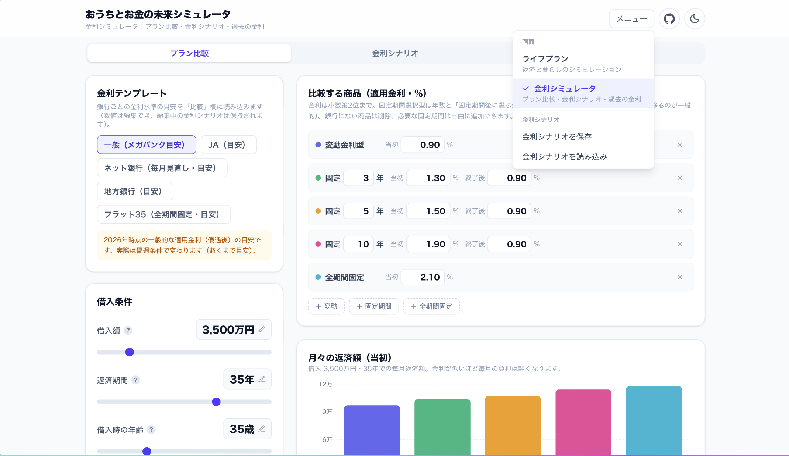
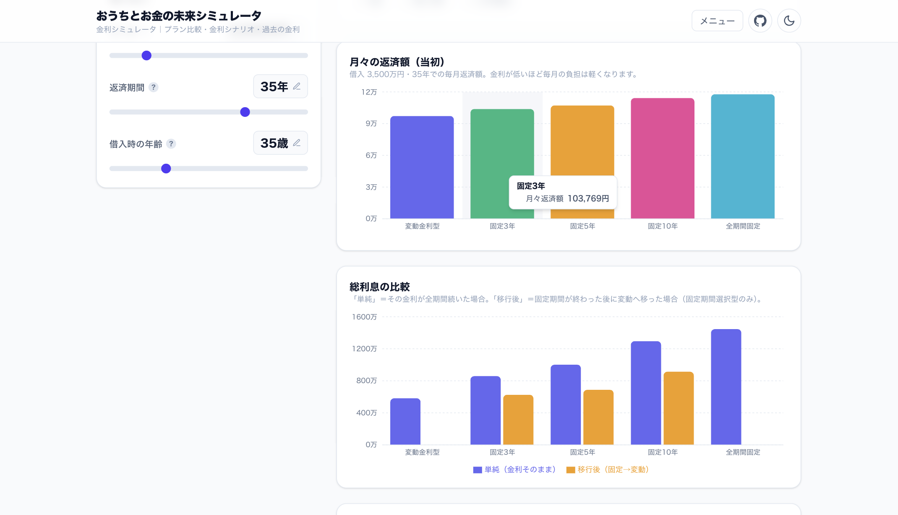
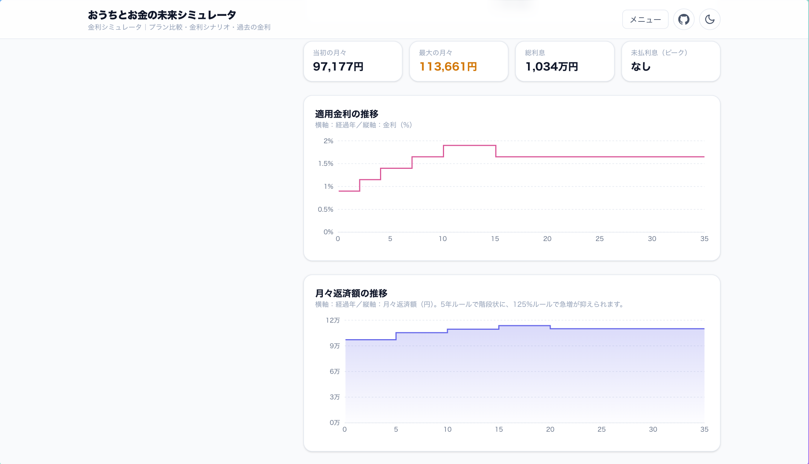
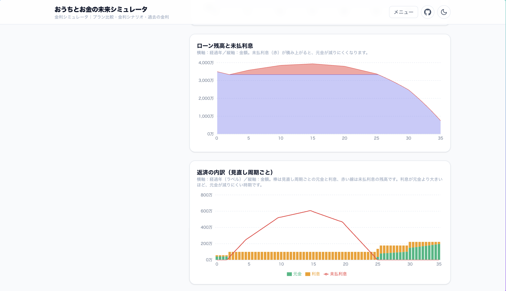
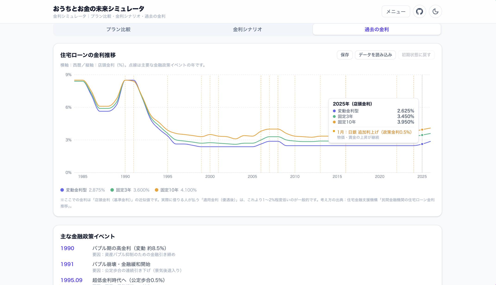
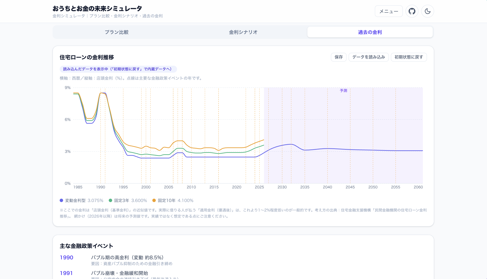

# おうちとお金の未来シミュレータ

住宅ローンを「組む」前の試算ではなく、**ローンを「返す」これからの暮らし**を見える化するライフプラン・シミュレータです。完済年齢・毎月の返済・家計のキャッシュフロー・貯金の推移を、グラフでまとめて確認できます。

**デモ → https://taogya.github.io/home-loan-simulator/**


> すべての計算はブラウザの中で完結し、入力内容は端末の外に送信されません。

## 特徴

- **完済までの残高推移**をひと目で確認（ライフイベントも縦線で表示）
- **年間キャッシュフロー**（収入・暮らし・ローン・イベント）を可視化
- **貯金の推移**を自動シミュレーション（定年・年金・退職金まで考慮）。貯金がマイナスになる時期は警告でお知らせ
- **手取りを自動概算**（給与所得控除・社会保険料・所得税・住民税の簡易計算）
- **収入・支出・ライフイベントを追加式**で管理（定番をワンタップ＋自由に追加、金額・期間は編集シートでまとめて調整）
- **項目をグループにまとめて整理**（折りたたみ表示・小計つき）
- **ライフイベント**を単発／定期（N年ごと）で登録
- **プラン追加ウィザード**で、代表的な入力から教育費・修繕費・車の費用などを自動で用意
- **共通設定（📌）**で、全プランで共通の項目をまとめて管理（グループ単位の切り替えも可能）
- **複数プランを並べて比較**（JSON で保存・読み込み）
- **金利シミュレータ**（別画面）：変動・固定（3/5/10年ほか）・全期間固定の比較、変動金利の3ルール（見直し周期・5年・125%）を反映した金利変動シミュレーション、過去の金利推移＋日銀イベント。金利シナリオは JSON で入出力
- 持ち家・賃貸の切り替え／繰り上げ返済／ボーナス払いにも対応
- ライト／ダークテーマ・スマホ表示対応

## 使い方

### 1. 借入条件を入力する

借入額・金利・返済期間・年齢を入力すると、完済予定の年齢と毎月の返済額・総利息・返済負担率がすぐに分かります（先頭の画像）。値はクリックで直接入力もできます。

### 2. 毎月の支出を整える

「定番から追加」で食費・固定資産税などをワンタップ、「自由に追加」で独自の項目も登録できます。各項目の「編集」から、金額・期間（○年後から○年間）・グループをまとめて調整。教育費のように関連する項目はグループにまとめて折りたたみ表示できます。


### 3. ライフイベントを登録する

車の買い替えやリフォームなどを「何年後」で追加。**単発**でも**定期（N年ごと・終了年齢つき）**でも登録でき、グラフに縦線で反映されます。


### 4. お金の流れをグラフで確認する

残高・収支・貯金をタブで切り替え。収入の線が積み上げ棒（暮らし＋ローン＋イベント）より上にあれば、その年は黒字です。貯金の推移では、定年・退職金・年金まで含めた残高の見込みが分かります。


### 5. プランを比較する

金利・返済期間・頭金の違うプランを並べて比較。完済年齢・総利息・返済負担率の差や、残高・貯金の推移をまとめて確認できます。


### スマホでも使えます

画面が狭いときは1カラムに切り替わり、入力からグラフ確認まで片手で操作できます。

<p>
  
  
  
  
</p>

## 金利シミュレータ

右上の「メニュー」から **金利シミュレータ** 画面に切り替えられます。ライフプラン画面とは独立して、金利そのものを比べたり、将来の金利変動を試したりできます。3つのタブで構成されています。

<!--
スクショ構図（メニュー・画面切り替え）:
- 右上の「メニュー」を開いた状態
- 「画面」の下に「ライフプラン」「金利シミュレータ」、区切り線の下に画面別の
  「金利シナリオを保存／読み込み」（またはプラン側の保存／読み込み）が見えるようにする
- 現在の画面にチェックが付いていることが分かる状態
-->


- **プラン比較**：変動・固定期間選択型（3年・5年・10年ほか自由に追加）・全期間固定を、同じ借入条件で比較。**月々返済額**・**総利息**の差をグラフと表で確認できます。固定期間選択型は「固定期間終了後は変動へ移行」した場合の総利息も表示します（※終了後は本来その時点の金利で選び直しますが、何もしなければ変動になるのが一般的です）。
- **金利シナリオ**：変動金利の3つのルール（**見直し周期**・**5年ルール**・**125%ルール**）を反映して、将来の金利変動を試算。**適用金利／月々返済額／残高と未払利息／返済の内訳（見直し周期ごと）** をグラフで確認できます。5年・125%ルールは多くの銀行で共通の仕組みですが、楽天銀行などネット銀行では採用しない（毎月即反映）ため、チェックで切り替えられます。
- **過去の金利**：変動・固定3年・固定10年の店頭金利の推移（1984〜）を、主要な日銀イベントとその**背景（要因）**つきで表示します。読み込んだデータが将来（現在年より先）まで延びている場合は、**現在年以降を薄く網かけして「予測」**と示します。

金利は「一般（メガバンク）」「JA」「ネット銀行」「地方銀行」「フラット35」の**テンプレート**を用意（数値は編集可・いずれも目安）。銀行にない商品は削除、必要な固定期間は自由に追加できます。











### 金利シナリオのインポート／エクスポート

「金利シナリオ」タブの予測（いつ・何％になるか）は、メニューの「**金利シナリオを保存／読み込み**」で JSON として入出力できます。フォーマットは次のとおりです。

```json
{
  "kind": "home-loan-rate-scenario",
  "version": 1,
  "name": "私の金利予測",
  "reviewMonths": 6,
  "rules": {
    "reviewMonths": 6,
    "paymentFixedYears": 5,
    "paymentCapRatio": 1.25
  },
  "points": [
    { "fromMonth": 0, "ratePct": 0.9, "note": "当初" },
    { "fromMonth": 24, "ratePct": 1.15, "note": "日銀利上げ想定" },
    { "fromMonth": 60, "ratePct": 1.4 }
  ]
}
```

| フィールド | 意味 |
| --- | --- |
| `kind` | 固定値 `"home-loan-rate-scenario"`（この値でシナリオと判定します） |
| `reviewMonths` | 金利の見直し周期（月）。半年なら `6`、毎月なら `1` |
| `rules.paymentFixedYears` | 5年ルール。使うなら `5`、使わないなら `0` |
| `rules.paymentCapRatio` | 125%ルール。使うなら `1.25`、使わないなら `0` |
| `points[].fromMonth` | 借入からの経過月（`0` = 当初）。昇順で並べます |
| `points[].ratePct` | その時点以降の適用金利（%） |
| `points[].note` | 変更理由などの任意メモ |

### ChatGPT などで金利シナリオを作ってもらうプロンプト例

生成AIに将来の金利シナリオ JSON を作ってもらうときは、次のプロンプトが使えます（前提条件はご自身の想定に置き換えてください）。

```text
あなたは住宅ローン金利の予測アシスタントです。次のスキーマに厳密に従って、
将来の変動金利の推移シナリオを JSON で1つだけ作成してください。

# スキーマ
- kind: 常に "home-loan-rate-scenario"
- version: 1
- name: シナリオ名（日本語で簡潔に）
- reviewMonths: 金利見直し周期（月）。半年=6、毎月=1
- rules.paymentFixedYears: 5年ルールを使うなら 5、使わないなら 0
- rules.paymentCapRatio: 125%ルールを使うなら 1.25、使わないなら 0
- points: 配列。各要素は
    { "fromMonth": 借入からの経過月(0=当初, 昇順の整数),
      "ratePct": その時点の適用金利(%),
      "note": 変更理由(任意) }

# 前提条件（ここを自分の想定に変える）
- 当初の適用金利: 0.9%
- 借入期間: 35年
- 見直し周期: 6ヶ月（5年ルール・125%ルールあり）
- 金利見通し: 日銀の利上げで今後5年は緩やかに上昇し、その後は横ばいを想定

# 出力
説明文は書かず、JSON だけを出力してください。
```

出力された JSON をファイルに保存し、金利シミュレータ画面のメニューから読み込めば、そのシナリオでの返済額・残高・未払利息を確認できます。

> 金利の数値・シナリオはあくまで試算用の想定です。生成AIの出力は必ず内容をご確認ください。

### 過去の金利データの読み込み

「過去の金利」タブでは、グラフのデータを自分のもの（例：正確な月次系列）に差し替えできます。**「保存」** で現在のデータを JSON で書き出し（編集のひな形になります）、**「データを読み込み」** で反映、**「初期状態に戻す」** で内蔵データへ復帰します。フォーマットは次のとおりです。

```json
{
  "kind": "home-loan-rate-history",
  "version": 1,
  "points": [
    { "year": 2024, "variable": 2.475, "fixed3": 3.31, "fixed10": 3.79 },
    { "year": 2025, "variable": 2.625, "fixed3": 3.45, "fixed10": 3.95 }
  ],
  "events": [
    { "year": 2024, "month": 3, "label": "マイナス金利政策 解除", "detail": "賃上げ・物価上昇の定着" }
  ]
}
```

| フィールド | 意味 |
| --- | --- |
| `points[].year` | 西暦（年）。昇順に並べます |
| `points[].variable` / `fixed3` / `fixed10` | その年の変動・固定3年・固定10年の店頭金利（%）。`null` にするとその系列はその年で線を止めます（例：将来の予測は固定系を `null` にして変動だけ延ばす） |
| `events[].year` / `month` | イベントの年（月は任意） |
| `events[].label` | イベント名（グラフの点線・年表に表示） |
| `events[].detail` | 変動の要因・背景（任意） |

> `year` を現在年より先（将来）まで入れると、その部分は自動で薄く網かけ（予測）表示になります。
> 過去は店頭金利、将来は自分の想定値、というように1つの系列（例：変動）を過去〜将来でつなげて描けます。

## ローカルで動かす

```bash
npm install
npm run dev
```

ブラウザで `http://localhost:5173/home-loan-simulator/` を開きます。

本番ビルド:

```bash
npm run build
```

## 技術スタック

React 19 ・ TypeScript ・ Vite ・ Tailwind CSS v4 ・ Recharts

## 注意

計算結果は概算です。実際の借入条件・税制・手数料などとは異なる場合があります。借入や投資の判断は、金融機関や専門家にご相談ください。

## ライセンス

[BSD 3-Clause License](LICENSE)
