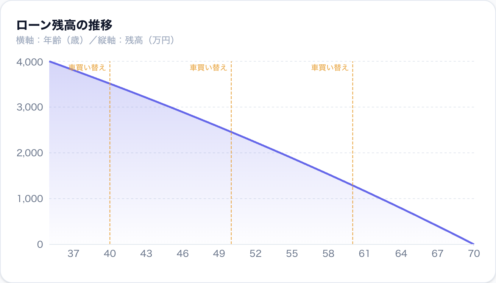
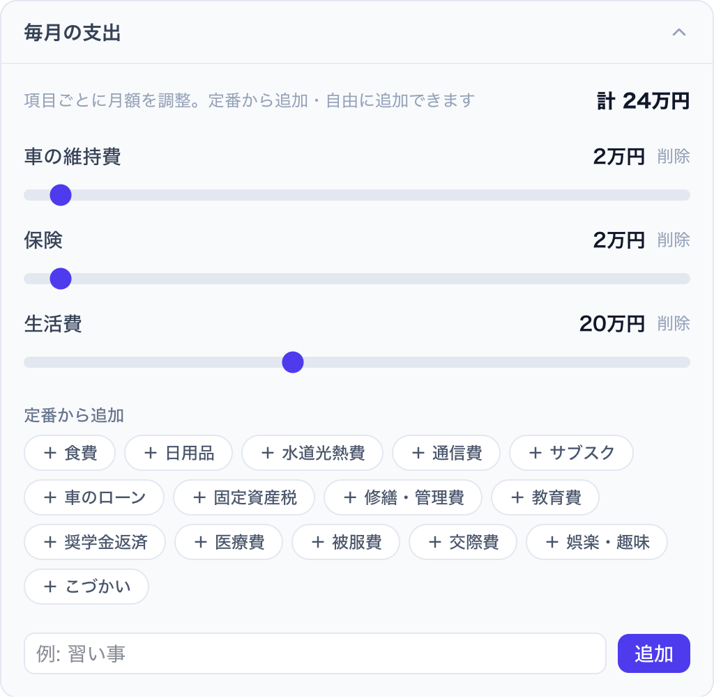
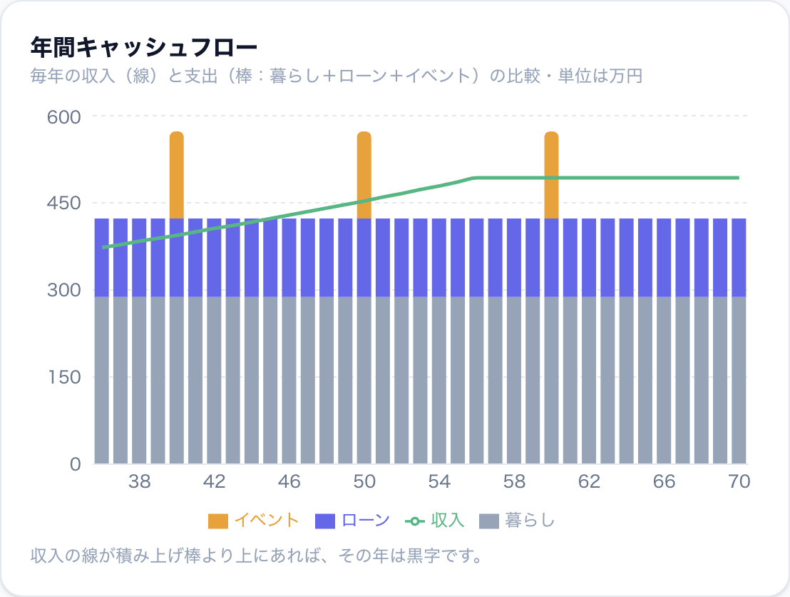

# おうちとお金の未来シミュレータ

住宅ローンを「組む」前の試算ではなく、**ローンを「返す」これからの暮らし**を見える化するライフプラン・シミュレータです。完済年齢・毎月の返済・家計のキャッシュフロー・貯金の推移を、グラフでまとめて確認できます。

**デモ → https://taogya.github.io/home-loan-simulator/**



> すべての計算はブラウザの中で完結し、入力内容は端末の外に送信されません。

## 特徴

- **完済までの残高推移**をひと目で確認
- **年間キャッシュフロー**（収入・暮らし・ローン・イベント）を可視化
- **手取りを自動概算**（給与所得控除・社会保険料・所得税・住民税の簡易計算）
- **毎月の支出を追加式**で管理（定番をワンタップ追加＋自由ラベル）
- **ライフイベント**を単発／定期（N年ごと）で登録
- **複数プランを比較**（JSON で保存・読み込み）
- ライト／ダークテーマ対応

## 使い方

### 1. 借入条件を入力する

借入額・金利・返済期間・月給を入力すると、完済予定の年齢と毎月の返済額がすぐに分かります。値はクリックで直接入力もできます。


### 2. 毎月の支出を整える

生活費や保険などをスライダーで調整。「定番から追加」で食費・固定資産税などをワンタップ、自由ラベルで独自の項目も追加できます。



### 3. ライフイベントを登録する

車の買い替えやリフォームなどを「何年後」で追加。**単発**でも**定期（N年ごと・終了年齢つき）**でも登録でき、グラフに反映されます。


### 4. お金の流れをグラフで確認する

残高・キャッシュフロー・貯金をタブで切り替え。収入の線が積み上げ棒（暮らし＋ローン＋イベント）より上にあれば、その年は黒字です。



## ローカルで動かす

```bash
npm install
npm run dev
```

ブラウザで `http://localhost:5173/home-loan-simulator/` を開きます。

本番ビルド:

```bash
npm run build
```

## 技術スタック

React 19 ・ TypeScript ・ Vite ・ Tailwind CSS v4 ・ Recharts

## 注意

計算結果は概算です。実際の借入条件・税制・手数料などとは異なる場合があります。借入や投資の判断は、金融機関や専門家にご相談ください。

## ライセンス

[BSD 3-Clause License](LICENSE)
