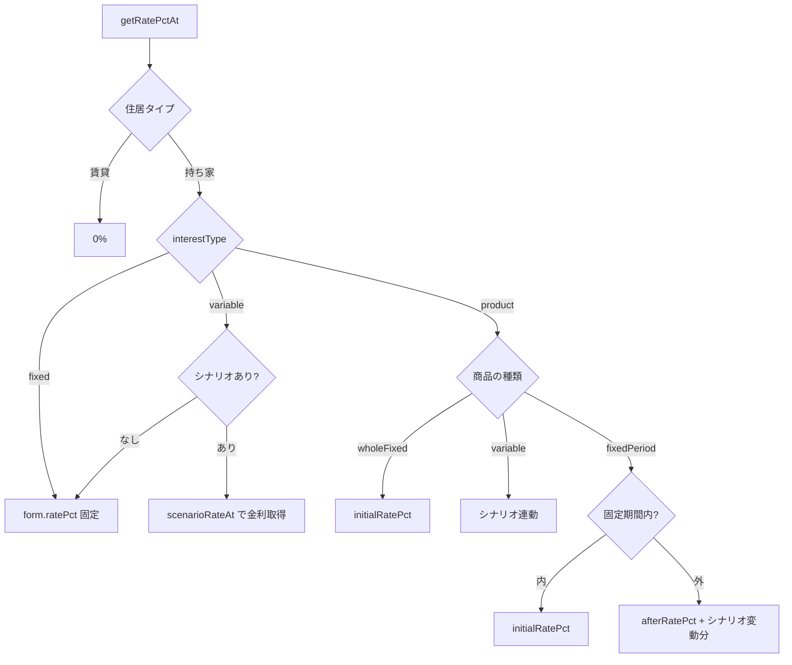
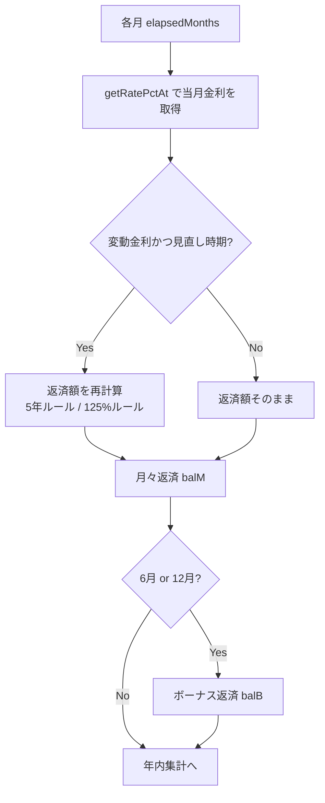
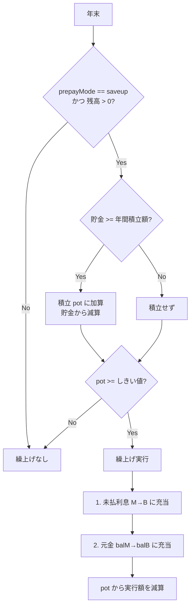
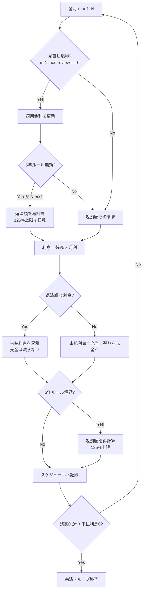

# 計算ロジック仕様

本プロジェクト「おうちとお金の未来シミュレータ」の計算ロジックをまとめたドキュメントです。
実装は [`src/lib/`](../src/lib/) 配下にあり、本書はその内容を数式・フロー付きで解説します。

- ライフプラン統合シミュレーション … [`src/lib/plan.ts`](../src/lib/plan.ts)
- 金利シミュレータ … [`src/lib/rate.ts`](../src/lib/rate.ts)
- ライフイベント判定・集約 … [`src/lib/events.ts`](../src/lib/events.ts)
- 金額フォーマット … [`src/lib/format.ts`](../src/lib/format.ts)
- 型定義 … [`src/types.ts`](../src/types.ts)

---

## 目次

1. [共通の前提・単位](#1-共通の前提単位)
2. [金融数式の基礎](#2-金融数式の基礎)
3. [手取り収入の概算](#3-手取り収入の概算)
4. [収入・支出・イベントの判定と金額](#4-収入支出イベントの判定と金額)
5. [ライフプラン統合シミュレーション](#5-ライフプラン統合シミュレーション)
6. [金利シミュレータ](#6-金利シミュレータ)
7. [簡略化している点・注意事項](#7-簡略化している点注意事項)

---

## 1. 共通の前提・単位

| 項目 | 内容 |
| --- | --- |
| 内部の金額単位 | すべて **円** |
| UI 入力の単位 | **万円**（`amountMan` など `Man` 接尾辞の項目は「万円」。内部で `× 10000` して円に変換） |
| 年齢の基準 | すべて **本人の年齢**（配偶者の収入なども本人年齢で管理） |
| 計算の粒度 | ライフプラン・金利シミュレータともに **月次** で残高・利息を計算 |
| 返済方式 | **元利均等返済**（毎期の返済額が一定） |
| 計算の完結 | すべてブラウザ内で完結し、外部送信しない |

金利は年利（%）で入力し、期あたりの利率へ換算して用います。

- 月利: $r_M = \dfrac{\text{年利[\%]}}{100 \times 12}$（コードでは `rate / 1200` とも表記）
- ボーナス期利（半年利）: $r_B = \dfrac{\text{年利[\%]}}{100 \times 2}$

---

## 2. 金融数式の基礎

[`src/lib/plan.ts`](../src/lib/plan.ts) と [`src/lib/rate.ts`](../src/lib/rate.ts) に共通する、元利均等返済の基本式です。

### 2.1 元利均等の毎期返済額 `annuity`

元本 $P$、期あたり利率 $r$、返済回数 $n$ に対する 1 期あたりの返済額 $A$:

$$
A =
\begin{cases}
\dfrac{P \cdot r \cdot (1+r)^n}{(1+r)^n - 1} & (r \neq 0) \\[2ex]
\dfrac{P}{n} & (r = 0)
\end{cases}
$$

- $n \le 0$ または $P \le 0$ のときは $A = 0$。

### 2.2 毎期返済額から元本を逆算 `presentValue`

毎期返済額 $A$ を $n$ 回続けたときの現在価値（元本）$P$:

$$
P =
\begin{cases}
\dfrac{A \cdot \left(1 - (1+r)^{-n}\right)}{r} & (r \neq 0) \\[2ex]
A \cdot n & (r = 0)
\end{cases}
$$

ボーナス払いの「1 回の返済額から、ボーナスで返済する元本」を求める際に使用します（[5.3](#53-ボーナス払いの元本分離)）。

### 2.3 一定額返済後の残高 `remainingBalance`

元本 $P$ を利率 $r$・毎期返済額 $A$ で $m$ 期返済した後の残高 $B_m$:

$$
B_m =
\begin{cases}
\max\!\left(0,\; P(1+r)^m - A \cdot \dfrac{(1+r)^m - 1}{r}\right) & (r \neq 0) \\[2ex]
\max\!\left(0,\; P - A \cdot m\right) & (r = 0)
\end{cases}
$$

固定期間選択型の「固定期間終了時点の残高」を求める際に使用します（[6.4](#64-商品比較-compareproducts)）。

---

## 3. 手取り収入の概算

額面給与から手取りを概算する処理です（[`src/lib/plan.ts`](../src/lib/plan.ts) の `estimateTakeHome`）。
配偶者控除・扶養控除・各種控除は考慮しない **目安計算** です。本人・配偶者の額面はそれぞれ個人単位で手取り換算します。

### 3.1 給与所得控除 `salaryDeduction`

2020 年以降の区分。額面 $g$（円）に対して:

| 額面 $g$ | 給与所得控除 |
| --- | --- |
| $g \le 1{,}625{,}000$ | $550{,}000$ |
| $g \le 1{,}800{,}000$ | $0.4g - 100{,}000$ |
| $g \le 3{,}600{,}000$ | $0.3g + 80{,}000$ |
| $g \le 6{,}600{,}000$ | $0.2g + 440{,}000$ |
| $g \le 8{,}500{,}000$ | $0.1g + 1{,}100{,}000$ |
| $g > 8{,}500{,}000$ | $1{,}950{,}000$（上限） |

### 3.2 社会保険料（概算）

健康保険・厚生年金・雇用保険の概算。約 780 万円を超える分は率を下げます。

$$
\text{social} = \min(g,\, 7{,}800{,}000) \times 0.15 + \max(0,\, g - 7{,}800{,}000) \times 0.05
$$

### 3.3 所得税 `incomeTax`（累進速算表）

課税所得 $t$（円）に対して（復興特別所得税は簡易のため省略）:

| 課税所得 $t$ | 所得税 |
| --- | --- |
| $t \le 0$ | $0$ |
| $t \le 1{,}950{,}000$ | $0.05t$ |
| $t \le 3{,}300{,}000$ | $0.10t - 97{,}500$ |
| $t \le 6{,}950{,}000$ | $0.20t - 427{,}500$ |
| $t \le 9{,}000{,}000$ | $0.23t - 636{,}000$ |
| $t \le 18{,}000{,}000$ | $0.33t - 1{,}536{,}000$ |
| $t \le 40{,}000{,}000$ | $0.40t - 2{,}796{,}000$ |
| $t > 40{,}000{,}000$ | $0.45t - 4{,}796{,}000$ |

### 3.4 手取りの算出

基礎控除 $480{,}000$ 円を用いて課税所得を求め、所得税・住民税を差し引きます。

$$
\begin{aligned}
\text{taxable} &= \max\!\left(0,\; g - \text{salaryDed} - \text{social} - 480{,}000\right) \\
\text{tax} &= \text{incomeTax}(\text{taxable}) \\
\text{residentTax} &= 0.1 \times \text{taxable} + 5{,}000 \\
\text{net} &= \max\!\left(0,\; g - \text{social} - \text{tax} - \text{residentTax}\right)
\end{aligned}
$$

- 住民税は「所得割 10% + 均等割 5,000 円」の簡易計算。
- $g \le 0$ のときは手取り $0$。

---

## 4. 収入・支出・イベントの判定と金額

### 4.1 収入が有効な年齢 `incomeActiveAt`

収入項目 `IncomeItem` が年齢 `age` で受け取れるか:

- `age < startAge` … 受け取らない
- `oneTime`（単発・退職金など） … `age === startAge` のときだけ受け取る
- `endAge` が設定されていて `age > endAge` … 受け取らない
- それ以外 … 受け取る

### 4.2 収入の年額 `incomeAnnualYen`

給与か否かでボーナス月数と昇給を反映します。

$$
\text{months} =
\begin{cases}
12 + \text{bonusMonths} & (\text{給与かつ月額基準}) \\
12 & (\text{給与以外で月額基準}) \\
1 & (\text{年額基準})
\end{cases}
$$

$$
\text{annual} = \text{amountMan} \times 10000 \times \text{months}
$$

給与で昇給率 `raiseRatePct` があるときは、昇給停止年齢 `raiseStopAge` までの経過年数分だけ複利で成長させます。

$$
\text{grown} = \max\!\left(0,\; \min(\text{age} - \text{startAge},\; \text{raiseStopAge} - \text{startAge})\right)
$$

$$
\text{annual} \mathrel{\times}= \left(1 + \frac{\text{raiseRatePct}}{100}\right)^{\text{grown}}
$$

### 4.3 年間手取り収入の集計 `annualIncomeAt`

指定年齢の収入項目を集計します。**額面**（`isGross`）は本人・配偶者それぞれで合算してから [`estimateTakeHome`](#3-手取り収入の概算) で手取り換算し、**手取り項目**（年金・退職金・その他）はそのまま加算します。

$$
\text{income} = \text{estimateTakeHome}(\text{grossSelf}) + \text{estimateTakeHome}(\text{grossSpouse}) + \text{net}
$$

- `includeOneTime = false` のときは単発収入（退職金など）を除外します。これは返済負担率の分母（現在の手取り年収）を求める際に使用します。

### 4.4 支出が有効な経過年 `expenseActiveAt`

支出項目 `ExpenseItem` が借入からの経過年 `elapsedYears` で有効か:

- 開始 `start = startAfterYears`（既定 0）、期間 `dur = durationYears`（既定 0 = ずっと）
- `elapsedYears < start` … 無効
- `dur > 0` かつ `elapsedYears >= start + dur` … 無効
- それ以外 … 有効

### 4.5 イベントの発生判定 `eventOccursAt`

ライフイベント `LifeEvent` が年齢 `age` で発生するか（[`src/lib/events.ts`](../src/lib/events.ts)）:

- `age < atAge` … 発生しない
- `intervalYears <= 0`（単発） … `age === atAge` のときだけ発生
- `untilAge` が設定されていて `age > untilAge` … 発生しない
- 定期 … $(\text{age} - \text{atAge}) \bmod \text{intervalYears} = 0$ のとき発生

`groupEventsByAge` は、定期イベントを範囲内で展開し、同じ年に複数あるときはラベルを「○○ 他N件」に集約してグラフの縦線マーカー用データを作ります。

---

## 5. ライフプラン統合シミュレーション

`simulatePlan(form, rateState?)` が本体です（[`src/lib/plan.ts`](../src/lib/plan.ts)）。
ローン・家計・貯金・繰上げ返済は相互に影響するため、**年次の 1 つのループの中で月次計算** を行います。

### 5.1 入力と期間

| 変数 | 内容 |
| --- | --- |
| `principal` | 借入額（円）。賃貸のときは 0 |
| `startAge` | 借入開始年齢 |
| `years` | 返済期間（年） |
| `simYears` | シミュレーション年数 = $\max(\text{years},\; 100 - \text{startAge})$ |

返済期間が終わっても、家計・貯金の推移は **100 歳まで** 追跡します。

### 5.2 金利の決定 `getRatePctAt`

経過月 `elapsedMonths` 時点の適用金利（年利 %）を、`interestType` に応じて決めます。

- **固定 (`fixed`)**: 常に `form.ratePct`。
- **変動 (`variable`)**: 金利シナリオがあれば `scenarioRateAt(scenario, elapsedMonths)`、なければ `form.ratePct`。
- **商品連動 (`product`)**: 選択商品の種類ごと。
  - 全期間固定: `initialRatePct`
  - 変動: シナリオ連動
  - 固定期間選択型: 固定期間内は `initialRatePct`、終了後は次式。

$$
\text{rate} = \text{afterRatePct} + \left(\text{scenarioRateAt}(\text{elapsed}) - \text{scenarioRateAt}(0)\right)
$$

`scenarioRateAt` は、シナリオの点（`fromMonth` 昇順）のうち `fromMonth <= month` を満たす直近の点の金利を採用するステップ関数です。

### 5.3 ボーナス払いの元本分離

ボーナス払いがある場合、借入元本をボーナス返済分と月々返済分に分けます。ボーナス 1 回の固定返済額 `bonus` から、[`presentValue`](#22-毎期返済額から元本を逆算-presentvalue) でボーナスが負担する元本を逆算します。

$$
\begin{aligned}
\text{bonusPrincipal} &= \min\!\left(\text{presentValue}(\text{bonus},\, r_B,\, 2\,\text{years}),\; \text{principal}\right) \\
\text{monthlyPrincipal} &= \text{principal} - \text{bonusPrincipal} \\
\text{monthly} &= \text{annuity}(\text{monthlyPrincipal},\, r_M,\, 12\,\text{years})
\end{aligned}
$$

以降、月々分の残高 `balM` とボーナス分の残高 `balB` を独立に管理します。

### 5.4 月次ループの流れ

各年 $y = 1 \dots \text{simYears}$、各月 $m = 0 \dots 11$ について次を行います。

#### 返済額の見直し（変動金利のみ）

`interestType !== 'fixed'` かつ `elapsedMonths > 0` のとき、見直しを行います。

- **5 年ルール有効時**（`paymentFixedYears > 0`、既定 5 年）:
  - $\text{elapsedMonths} \bmod (12 \times \text{paymentFixedYears}) = 0$ の月に返済額を再計算。
  - 新返済額は残返済月数に対する `annuity`。ただし **125% ルール**（`paymentCapRatio`、既定 1.25）で上限を掛けます。

$$
\text{payment}_{\text{new}} = \min\!\left(\text{annuity}(\text{bal} + \text{unpaidInterest},\, r,\, \text{remaining}),\; \text{payment}_{\text{old}} \times \text{capRatio}\right)
$$

  - ボーナス分も同様に、5 年 = 10 回ごとに残ボーナス回数で再計算し 125% 上限を適用。
- **5 年ルール無効時**（`paymentFixedYears = 0`）: `reviewMonths`（既定 6 ヶ月）ごとに上限なしで返済額をリセット。

#### 月々返済の元金・利息配分と未払利息

当月利率 $r_{M,\text{cur}}$ に対し、利息と元金充当を計算します。

$$
\text{interest} = \text{balM} \times r_{M,\text{cur}}, \qquad
\text{principalPart} = \text{payment} - \text{interest}
$$

- $\text{principalPart} < 0$（返済額が利息に満たない）… 差額を **未払利息** `unpaidInterestM` に累積し、元金は減らない。
- $\text{principalPart} \ge 0$ … まず溜まっている未払利息へ充当し、残りを元金に充当。
- 元金充当は残高を上限とし、残高が 0.5 円未満になったら 0 に丸める。

ボーナス返済（$m = 5$ または $m = 11$、すなわち 6 月・12 月相当）も同じロジックで `balB` / `unpaidInterestB` を処理します。

> 未払利息には利息を付さない（一般的な変動金利の運用に合わせた簡略化）。

### 5.5 家計・貯金の計算

その年の家計を集計します。

$$
\begin{aligned}
\text{income} &= \text{annualIncomeAt}(\text{incomes},\, \text{age}) \\
\text{annualExpense} &= \left(\textstyle\sum_{\text{有効な支出}} \text{amountMan}\right) \times 12 \times 10000 + \text{rentAnnual} \\
\text{eventExpense} &= \textstyle\sum_{\text{発生イベント}} \text{amountMan} \times 10000 + \text{renewalFee} \\
\text{cashBalance} &= \text{income} - \text{annualExpense} - \text{yearRepayment} - \text{eventExpense} \\
\text{savings} &\mathrel{+}= \text{cashBalance}
\end{aligned}
$$

- 賃貸のとき: 家賃 `rentAnnual = rentMan × 12 × 10000`。更新料は `renewalIntervalYears` の倍数の年に `renewalFeeMan × 10000` を計上。
- `yearRepayment` は当年の通常ローン返済（元金 + 利息、繰上げは含まない）。
- 収支がマイナスの年が続くと貯金が減り、UI 側でマイナス警告を表示します。

### 5.6 繰上げ返済（積立方式・期間短縮型）

`prepayMode === 'saveup'` かつローン残高が残っているとき、毎年積み立て、しきい値に達したら実行します。

1. 毎年 `prepaySaveupPerYearMan`（円換算）を、貯金が足りていれば積立ポット `pot` へ移動（貯金から減算）。
2. `pot >= prepayTriggerMan × 10000` に達したら、実行額 $\text{actual} = \min(\text{pot},\ \text{残高合計} + \text{未払利息})$ を計算。
3. 充当順は **未払利息（月々→ボーナス）→ 元金（月々→ボーナス）**。
4. 実行額を `pot` から減算。期間短縮型なので毎月の返済額は変えず、残高が減ることで完済が早まります。

### 5.7 集計される結果 `PlanResult`

ループ後、次を集計して返します。

| フィールド | 計算 |
| --- | --- |
| `monthlyPayment` | 月々返済額 `monthly` |
| `bonusPayment` | ボーナス 1 回の返済額 `bonus` |
| `annualRepayment` | 持ち家: $\text{monthly} \times 12 + \text{bonus} \times 2$ ／ 賃貸: $\text{rentMan} \times 12 \times 10000$ |
| `totalInterest` | 全期間の利息合計 |
| `totalPayment` | $\text{principal} + \text{totalInterest}$ |
| `payoffYears` | 残高が 0 になった経過年（繰上げで短縮されうる） |
| `payoffAge` | $\text{startAge} + \text{payoffYears}$ |
| `startAnnualIncome` | 現在の手取り年収（単発収入を除外） |
| `repaymentBurdenPct` | $\dfrac{\text{annualRepayment}}{\text{startAnnualIncome}} \times 100$（%） |
| `maxSavings` | 期間中の貯金残高の最大 |
| `maxMonthlyPayment` | 期間中の月返済額のピーク `peakMonthlyPayment` |
| `schedule` | 年ごとの推移（`year = 0` を含む） |

### 5.8 共通設定の合成 `mergeCommonForm`

全プラン共通の収入・支出・イベントを、各プラン専用の項目と結合してからシミュレーションします（共通 → 専用の順）。

$$
\begin{aligned}
\text{incomes} &= [\,\text{common.incomes},\; \text{form.incomes}\,] \\
\text{expenses} &= [\,\text{common.expenses},\; \text{form.expenses}\,] \\
\text{events} &= [\,\text{common.events},\; \text{form.events}\,]
\end{aligned}
$$

---

## 6. 金利シミュレータ

ライフプラン画面とは独立した、金利そのものを比較・検証する画面のロジックです（[`src/lib/rate.ts`](../src/lib/rate.ts)）。

### 6.1 商品定義 `RateProductDef`

| 種類 `kind` | 内容 |
| --- | --- |
| `variable` | 変動金利型 |
| `fixedPeriod` | 固定期間選択型（`fixedYears` 年固定、終了後は `afterRatePct`） |
| `wholeFixed` | 全期間固定 |

### 6.2 変動金利の 3 ルール `VariableRules`

| ルール | 既定値 | 意味 |
| --- | --- | --- |
| `reviewMonths` | 6 | 金利見直し周期（月）。半年ごと |
| `paymentFixedYears` | 5 | 返済額を据え置く年数（5 年ルール）。0 で無効 |
| `paymentCapRatio` | 1.25 | 見直し時の返済額上限倍率（125% ルール）。0 で無効 |

### 6.3 変動金利シナリオの月次計算 `simulateRateScenario`

借入条件 `RateSimInput` と金利シナリオ `RateScenario` から、月次スケジュールを計算します。

処理の要点:

- **初期返済額**: $\text{payment}_0 = \text{annuity}(\text{principal},\ \text{initialRate}/1200,\ \text{totalMonths})$
- **見直し境界**（$(m-1) \bmod \text{review} = 0$）で適用金利を更新。
  - 5 年ルール無効時は、見直しごとに残返済月数で返済額を再計算し、125% 上限が有効ならそれを適用。
- **月次の元利計算**: 利息 $= \text{balance} \times \dfrac{\text{rate}}{1200}$、元金 $= \text{payment} - \text{interest}$。
  - 返済額が利息に満たなければ差額を未払利息に累積（元金は減らない）。満たせば未払利息へ充当してから元金へ。
- **5 年ルール適用時**（`fixedMonths > 0`）は $m \bmod \text{fixedMonths} = 0$ の月に、残高 + 未払利息と残返済月数から返済額を再計算し 125% 上限を適用。
- 残高が 0 かつ未払利息が 0.5 円以下になった月を **完済月** としてループを終了。

戻り値 `RateSimResult` には、初期月返済額・月次スケジュール・総利息（発生ベース）・総返済額・最大返済額・完済月・期間終了時の残高／未払利息・未払利息のピーク・未払利息発生の有無を含みます。

### 6.4 商品比較 `compareProducts`

各商品について 2 通りの見方で総利息を計算します。

**単純比較（`Simple`）** … 当初金利が全期間続く前提:

$$
\begin{aligned}
\text{monthlyPayment} &= \text{annuity}(\text{principal},\ r_0,\ \text{totalMonths}) \\
\text{totalPaymentSimple} &= \text{monthlyPayment} \times \text{totalMonths} \\
\text{totalInterestSimple} &= \text{totalPaymentSimple} - \text{principal}
\end{aligned}
$$

**移行シナリオ（`Transition`）** … 固定期間選択型のみ。固定期間終了後に `afterRatePct` へ移行:

$$
\begin{aligned}
\text{phase1} &= \text{fixedYears} \times 12 \\
\text{balAfter} &= \text{remainingBalance}(\text{principal},\ r_0,\ \text{monthlyPayment},\ \text{phase1}) \\
\text{payment2} &= \text{annuity}(\text{balAfter},\ r_{\text{after}},\ \text{totalMonths} - \text{phase1}) \\
\text{total} &= \text{monthlyPayment} \times \text{phase1} + \text{payment2} \times (\text{totalMonths} - \text{phase1}) \\
\text{totalInterestTransition} &= \text{total} - \text{principal}
\end{aligned}
$$

### 6.5 シナリオの検証 `isValidScenario`

JSON インポート時の妥当性チェック:

- `kind === 'home-loan-rate-scenario'`
- `points` が 1 点以上の配列で、各点が数値の `fromMonth` と `ratePct` を持つ
- `rules` は任意（あればオブジェクトであること。欠損は既定値で補完）

---

## 7. 簡略化している点・注意事項

本シミュレータは **目安** を素早く把握するためのものです。計算根拠は「数学的事実」「税法の事実（ただし基準年度に注意）」「一般的な概算モデル・業界慣行」が混在します。比較・概算の用途では実用十分ですが、**絶対額は実額と差が出ます**。

### 7.1 計算根拠の分類

| 計算 | 位置づけ | 備考 |
| --- | --- | --- |
| 元利均等返済 `annuity` / 現在価値 `presentValue` / 残高 `remainingBalance` | **数学的事実** | 標準的な金融数学の公式 |
| 所得税の累進速算表（[3.3](#33-所得税-incometax累進速算表)） | **税法の事実** | 国税庁の速算表と一致。復興特別所得税 2.1% のみ省略 |
| 給与所得控除（[3.1](#31-給与所得控除-salarydeduction)） | **税法の事実（旧年度）** | 令和2〜6年分の区分。令和7年改正に未追随（[7.2](#72-税制の基準年度)） |
| 基礎控除 48 万円（[3.4](#34-手取りの算出)） | **税法の事実（旧年度）** | 令和6年以前の額。令和7年改正で最低 58 万円へ（[7.2](#72-税制の基準年度)） |
| 社会保険料 15%（780 万円超は 5%） | **概算モデル** | 標準報酬月額の等級・上限の厳密計算はしない |
| 住民税 所得割 10% + 均等割 5,000 円 | **概算モデル** | 所得割 10% は事実。基礎控除（43 万円）等は簡略化 |
| 変動金利の 5 年・125%・見直し周期ルール | **業界慣行モデル** | 多くの銀行の慣行。全機関が採用するわけではない |
| 未払利息に利息を付さない／繰上げは期間短縮型のみ | **一般的運用の簡略化** | — |

### 7.2 税制の基準年度

手取り計算（[3 章](#3-手取り収入の概算)）は **令和6年以前（令和2〜6年分）の税制** を基準にしています。2026 年時点で適用される **令和7年度改正には未追随** です。

| 項目 | 本実装の値 | 令和7年分以降（現行） |
| --- | --- | --- |
| 給与所得控除の最低保障 | 55 万円（162.5 万円以下） | **65 万円**（190 万円以下）※区分も変更 |
| 基礎控除 | 48 万円 固定 | **最低 58 万円**（中所得層）〜 95 万円 |

- 出典（いずれも令和7年4月1日現在法令等）: 国税庁 [No.1410 給与所得控除](https://www.nta.go.jp/taxes/shiraberu/taxanswer/shotoku/1410.htm)、[No.1199 基礎控除](https://www.nta.go.jp/taxes/shiraberu/taxanswer/shotoku/1199.htm)、[No.2260 所得税の税率](https://www.nta.go.jp/taxes/shiraberu/taxanswer/shotoku/2260.htm)。
- 控除額が現行より小さいため、**手取りをやや保守的（低め）に算出** する傾向があります。

### 7.3 その他の簡略化

- **手取り計算**は概算です。配偶者控除・扶養控除・住宅ローン控除・iDeCo/ふるさと納税等の各種控除は考慮しません。社会保険料・住民税も簡易な率で近似しています。復興特別所得税は省略しています。
- **社会保険料**は約 780 万円を境に率を切り替える近似で、標準報酬月額の等級・上限の厳密な計算は行いません。
- **未払利息に利息は付きません**（一般的な変動金利の運用に合わせた簡略化）。
- **繰上げ返済は期間短縮型のみ**（返済額軽減型は非対応）。積立方式で、しきい値到達時にまとめて実行します。
- **インフレ・資産運用利回り**は考慮しません（貯金は名目額のまま推移）。
- ボーナス返済月は **6 月・12 月相当**（ループ上の $m = 5, 11$）に固定しています。
- 端数処理として、残高が 0.5 円未満になった時点で 0 に丸めています。

実装の詳細は各ソースファイルのコメントも参照してください。
